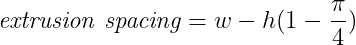
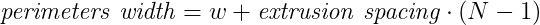
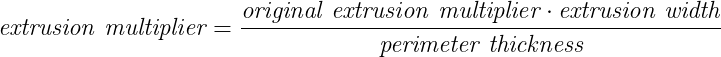
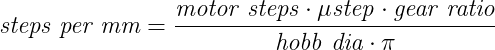
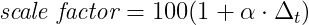
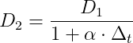
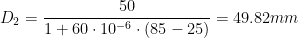
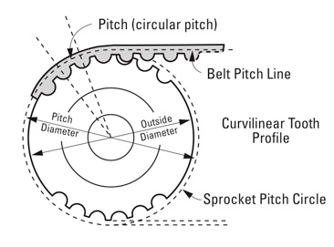
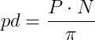

# 3D Printing Cheat Sheet

# Calculators

## Table of contents
* [&nldr;](../3d_printing/README.md)
* [Perimeters Width](#perimeters-width)
* [Extrusion Multiplier](#extrusion-multiplier)
* [Extruder steps/mm](#extruder-stepsmm)
* [Part Scaling](#part-scaling)
* [Pulley Diameters](#pulley-diameters)
* [Resources](#resources)

## Perimeters Width

In Slic3r and PrusaSlicer, the perimeters are overlapping each others while being printed (two perimeters of 0.45mm extrusion width will be 0.86mm and not 0.90mm). More information here: [Slic3r Flow Math][slic3r_flow_math] and [PrusaSlicer Layers and Perimeters][prusaslicer_layers_perimeters].

  

Where:
| variable | description |  unit |
|:---------|:------------|:-----:|
| *w* | extrusion width (eg. 0.45mm) | mm |
| *h* | layer height (eg. 0.20mm) | mm |
| *N* | number of perimeters | |
| *extrusion spacing* | spacing between extrusions with overlapping | mm |
| *perimeters width* | width of perimeters as printed in Slic3r or PrusaSlicer | mm |

## Extrusion Multiplier

Where:
| variable | description |  unit |
|:---------|:------------|:-----:|
| *extrusion&nbsp;multiplier* | extrusion multiplier adjusted | |
| *original&nbsp;extrusion&nbsp;multiplier* | original extrusion multiplier set in your slicer | |
| *extrusion&nbsp;width* | extrusion width set in your slice (0.45mm if you are using a 0.4mm nozzle and PrusaSlicer) | mm |
| *perimeter&nbsp;thickness* | measured perimeter thickness (average of measured perimeters thickness if you measure more than one) | mm |

More information here: [Extrusion multiplier calibration guide][extrusion_multiplier_calibration_guide]

## Extruder steps/mm

Where:
| variable | description |  unit |
|:---------|:------------|:-----:|
| *steps&nbsp;per&nbsp;mm* | number of extruder steps for one full rotation | |
| *motor&nbsp;steps* | number of step for one full rotation of the motor. In general, 200 for 1.8° motor and 400 for 0.9° motor | |
| *&mu;step* | micro stepping configured in the 3D printer firmware (eg. 16, 32, 64...) | |
| *gear&nbsp;ratio* | gear ratio (eg. 3:1) | |
| *hobb&nbsp;dia* | effective hobb gear diameter | mm |

Example:

For an 1.8° stepper, 16 micro-stepping configuration, a gear ratio of 50:17 and Bondtech 1.75/5.0 drive gears:  

## Part Scaling

As the printed parts are printed warm and then cooldown to room temperature they will shrink in size. The shrinkage depends on the thermal expansion coefficient of the filament material used. Note that filament additives can change the thermal expansion factor of your material.

### Slicer scaling factor

To calculate the scale percentage to use in your slicer to account for shrinkage.

Where:
| variable | description |  unit |
|:---------|:------------|:-----:|
| *scale&nbsp;factor* | percentage to scale your print part in your slicer | |
| *&alpha;* | filament material thermal expansion coefficient (see [Common thermal expansion coefficient](#common_thermal_expansion_coefficient) table bellow) | K-1 |
| *&Delta;t* | difference between the bed temperature and the room temperature |  |

Example:

For a PETG part with a bed at 85°C and room temperature at 25°C:  

### Printed part size

To calculate a dimension after printing and cooldown.

Where:
| variable | description |  unit |
|:---------|:------------|:-----:|
| *D1* | dimension in CAD or slicer (before printing) | mm |
| *D2* | dimension after printing and cooldown | mm |
| *&alpha;* | filament material thermal expansion coefficient (see [Common thermal expansion coefficient](#common_thermal_expansion_coefficient) table bellow) | K-1 |
| *&Delta;t* | difference between the bed temperature and the room temperature |  |

Example:

For a PETG part with a width of 50mm,bed at 85°C and room temperature at 25°C:  

### Common thermal expansion coefficients

| material | *&alpha;* | source |
|:---------|:----------|:-------|
| ABS         | 72 to 110 &middot; 10-6 K-1 | [1][cte_abs01], [2][cte_common01], [3][cte_common02] |
| ASA         | 60 to 110 &middot; 10-6 K-1 | [1][cte_common02] |
| PC          | 65 to 70 &middot; 10-6 K-1 | [1][cte_pc01], [2][cte_common02] |
| PETG        | 51 to 68 &middot; 10-6 K-1 | [1][cte_petg01], [2][cte_petg02], [3][cte_petg03] |
| PLA (4043D) | 41 to 68 &middot; 10-6 K-1 | [1][cte_pla01], [2][cte_pla02], [3][cte_common02] |

## Pulley Diameters

Calculations for Gates 2GT and GT3 pulleys. More details here: [Timing Belt and Pulley](../mechanical/timing_belt_pulley.md)

  

Where:
| variable | description |  unit |
|:---------|:------------|:-----:|
| pd   | pitch diameter | mm |
| P    | belt pitch | mm |
| N    | number of pulley teeth |  |
| od   | pulley outside diameter | mm |
| U    | Distance from pitch line to belt tooth bottom. - U = 0.254mm for 2GT and GT2/3 2mm pitch belts - U = 0.381mm for 3GT and GT2/3 3mm pitch belts | mm |

Example:

For a GT3 2mm pitch belt and 20T pulley:  
  

## Resources

Resources used for those calculations:

  * Monard, J.-A. (1994). *Tome IV Chaleur*. Centrale d'Achats de la Ville de Bienne
  * Belt and pulleys: https://www.sdp-si.com/PDFS/Technical-Section-Timing.pdf
  * The formulas are generated by https://latex.codecogs.com/
  * [Slic3r Flow Math][slic3r_flow_math]
  * [PrusaSlicer Perimeters and Layers][prusaslicer_layers_perimeters]

[slic3r_flow_math]: https://manual.slic3r.org/advanced/flow-math
[prusaslicer_layers_perimeters]: https://help.prusa3d.com/en/article/layers-and-perimeters_1748

[extrusion_multiplier_calibration_guide]: https://guides.bear-lab.com/Guide/Extrusion+multiplier+and+filament+diameter/8?lang=e

[cte_abs01]: https://www.sd3d.com/portfolio/abs/
[cte_pc01]: https://xometry.eu/wp-content/uploads/2021/03/Polycarbonate.pdf
[cte_petg01]: https://www.sd3d.com/wp-content/uploads/2017/06/MaterialTDS-PETG_01.pdf
[cte_petg02]: https://devel.lulzbot.com/filament/Rigid_Ink/PETG%20DATA%20SHEET.pdf
[cte_petg03]: https://github.com/prusa3d/Original-Prusa-MINI/blob/master/DOCUMENTATION/PRINT%20SETTINGS/recommended%20print%20settings%20for%20Original%20Prusa%20MINI.md
[cte_pla01]: https://xometry.eu/wp-content/uploads/2021/03/PLA.pdf
[cte_pla02]: https://www.sd3d.com/wp-content/uploads/2017/06/MaterialTDS-PLA_01.pdf
[cte_common01]: https://www.engineeringtoolbox.com/linear-expansion-coefficients-d_95.html
[cte_common02]: https://www.cosineadditive.com/en/materials
