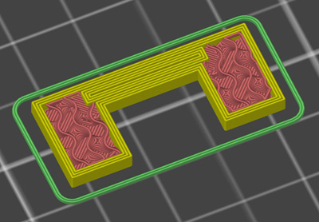
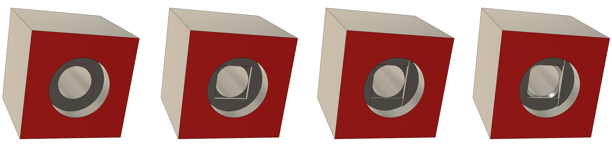
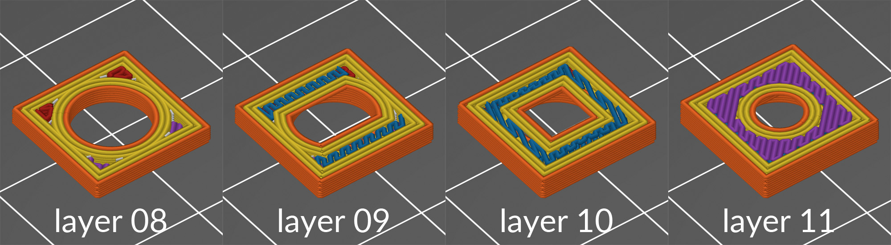

# 3D Printing Cheat Sheet

## Techniques

### Table of contents
* [Selective Infill](#selective-infill)
* [Clean Vertical Hole](#clean-vertical-hole)
* [Sharp Angle](#sharp-angle)
* [Mid-Air Hole](#mid-air-hole)
* [SCAD to STEP Conversion](#scad-to-step-conversion)
* [Sanding](#sanding)

### Selective Infill

Selective infill is a technique used to create stronger 3D printed parts. It consists of creating a hole in the middle of the infill, like this the slicer will create perimeters around this hole. It will also add top and bottoms layers for this hole.

Placed correctly, a selective infill can double the perimeters or top/bottom layers. To achieve this you need to know how thick are the bottom/top layers, how wide are the perimeters and what is the minimum size of hole you can apply.

I first saw similar technique in Prusa OpenSCAD files and recently in an interesting article from [Adrian Bowyer](https://reprapltd.com/fibre/).

#### Min hole size

Slic3r and PrusaSlicer will consider a hole smaller or equal to 0.10mm x 0.10mm as a defect in the STL and will ignore it. I then usually use the value 0.101x0.101mm as the minimum hole size for selective infill. You can also use bigger holes.

#### Perimeters width

The perimeters are overlapping each others so you need to take this overlap into account. Slic3r documentation explains how to calculate the overlap here: [manual.slic3r.org/advanced/flow-math#spacing-paths](https://manual.slic3r.org/advanced/flow-math#spacing-paths)

Note: No overlap is applied for bridging but this will be very rarely useful when doing selective infill.

| Parameter          | Formula | Value Example |
|:------------------:|:-------:|:-----:|
| extrusion_width    |         | 0.45mm |
| layer_height       |         | 0.20mm |
| num_perimeters     |         | 4 |
| extrusion_spacing  | extrusion_width - layer_height * (1 - &pi;/4) | 0.4071mm |
| perimeters_width   | extrusion_width + (num_perimeters-1) * extrusion_spacing | 1.67mm |

#### Tops and bottoms thickness

| Parameter              | Formula | Value Example |
|:----------------------:|:-------:|:-----:|
| layer_height           |  | 0.20mm |
| num_top_bottom         |  | 5mm |
| top_bottom_thickness   | num_top_bottom * layer_height | 1mm |

### Clean Vertical Hole

Used to put more space on top of a vertical hole and avoid clean-up after printing. I first found this technique in Prusa OpenScad files but I have defined my own method to achieve a good result.

Where
* h = layer height
* a = 30°
* w = if the hole is too small, w will be equal or lower than 0. In this case I recommend to make the angle 'a' more vertical.

For holes smaller than 3mm diameter I make a simple triangle (no flat on top) with those values:
* h >= layer height
* a >= 30°
* w = 0

### Sharp Angle

When printing angles the filament takes a small short-cut resulting in a rounded angles. After several tests with PETG, I found that this geometry creates better squared corners. Might need some adaptation for other type of filaments.

Where
* e = extrusion width
* a = angle (45° for a printed angle of 90°)

### Mid-Air hole

This techniques allows to print a hole in mid-air without support or post-processing. The principle of this technique is to force the slicer to make bridging to support the hole.

The images bellow shows you how to design this technique in CAD step by step (the red surface will be touching the bed in the slicer). Every steps correspond to your layer height. The last step where I add the chamfers is not mandatory but improves the print quality (I am using 0.3mm 45° chamfer for 0.2mm layer height):

To better understand how it works, the images bellow shows you what you will see on the slicer:

You can download this part if you want to test yourself: [STEP File](files/mid_air_hole.step) or [STL File](files/mid_air_hole.stl)

This technique is also explained with the excellent video of Adam from Vector 3D: [youtube.com/watch?v=IVtqAn4oDDE](https://www.youtube.com/watch?v=IVtqAn4oDDE)

### SCAD to STEP Conversion

Tutorial to convert OpenSCAD files to STEP files using FreeCAD

https://forum.lulzbot.com/viewtopic.php?t=243

### Sanding

To get smooth surface from a 3D print

Thanks to JKSniper for this technique : https://www.thingiverse.com/thing:2307550 and https://youtu.be/0vgynnYzo08

#### Material
* Sandpaper 200, 500 and 800
* Spray filler
* Spray paint (acrylic), glossy or matt
* Bowl big enough to put your part in
* Water (in the bowl)

#### Steps
1. Sand as much as you can the edges using 200 sandpaper. Regularly put the sandpaper in water. At the end, surface should be smooth and even
1. Clean the part and dry it carefully
1. Mount the part in a way that you can spray all around
1. Spray with filler and let dry. Depending on the first sanding, apply one or more layers
1. Sand using firs 500 and then 800 sandpaper until it is smooth everywhere. Regularly put the sandpaper in water.
1. Clean, rinse carefully the part and let it dry
1. Spray the acrylic paint
