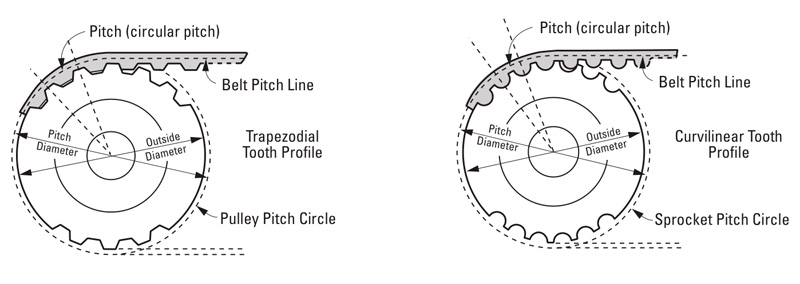
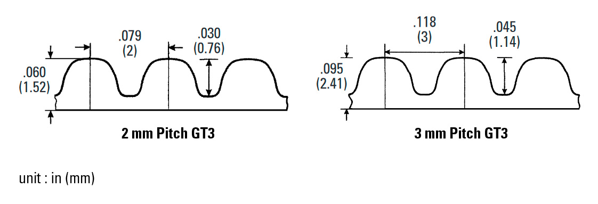

# Mechanical Cheat Sheet

## Timing Belt and Pulley

### Table of contents
* [Glossary](#glossary)
* [Gates 2GT Specifications](#gates-2gt-specifications)
* [Gates GT3 Specifications](#gates-gt3-specifications)
* [Pulley Outside Diameter](#pulley-outside-diameter)

### Glossary

### Gates 2GT Specifications

2GT belts are manufactured by an affiliate company of Gates called "Gates Unitta", in Asia. Gates 2GT belts are using a different profile than GT2/GT3. As they are not 100% compatible with GT2/GT3 they could lead to an increase in backlash and belt wear, specially on a 3D printer.

### Gates GT3 Specifications

GT2 and GT3 belts are made by Gates USA. They share the same profile and are 100% compatible. GT3 is the new version with a better construction.

### Pulley Outside Diameter

`pd = P*N / π`

`O.D. = pd - 2*U`

Where
  * pd = pitch diameter
  * P = belt pitch
  * N = number of pulley teeth
  * O.D. = pulley outside diameter
  * U = Distance from Pitch Line to Belt Tooth Bottom 
    * U = 0.254mm for 2GT and GT2/3 2mm pitch belts
    * U = 0.381mm for 3GT and GT2/3 3mm pitch belts

Example for GT3 2mm pitch and 20T pulley :
  * `pd = 2 * 20 / π = 12.732mm`
  * `O.D. = 12.732 - 2*0.254 = 12.224mm`

### Sources

  * [Openbuilds](https://openbuildspartstore.com/3gt-gt2-3m-timing-belt-by-the-foot/)
  * [SPD/SI](http://www.sdp-si.com/PDFS/Technical-Section-Timing.pdf)